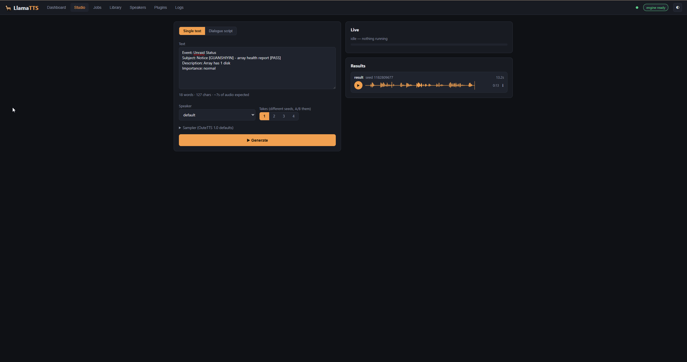
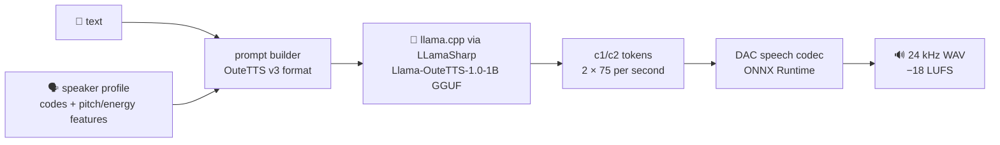
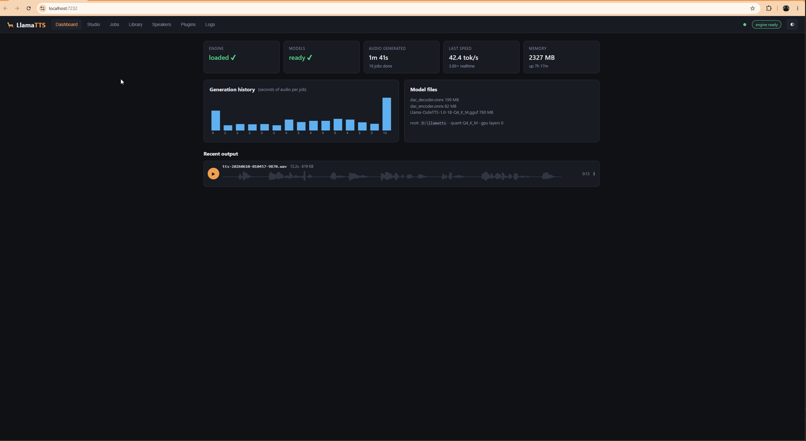
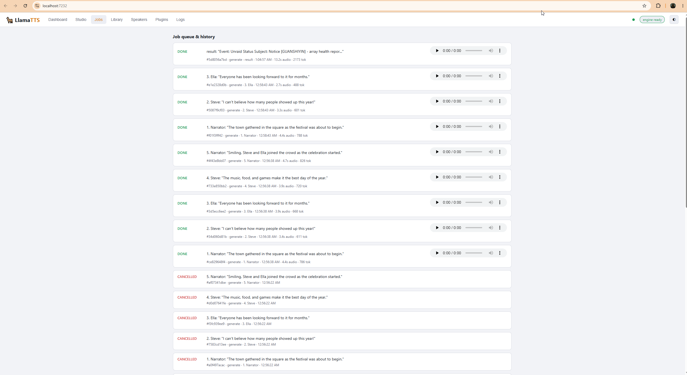
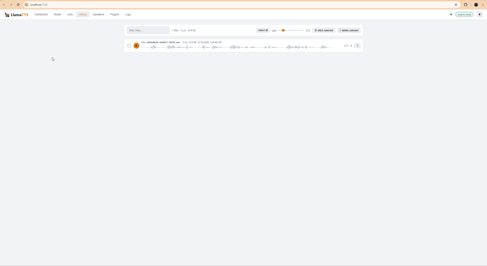
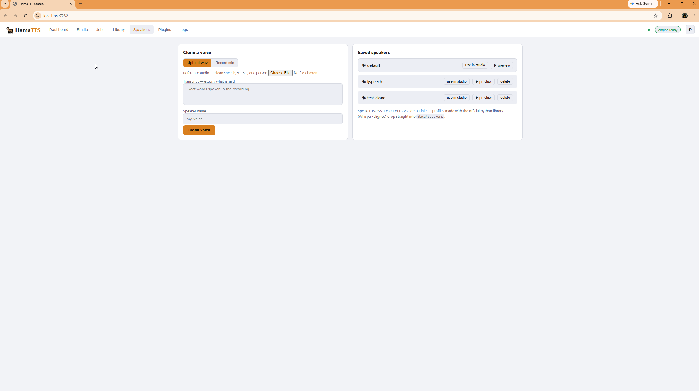
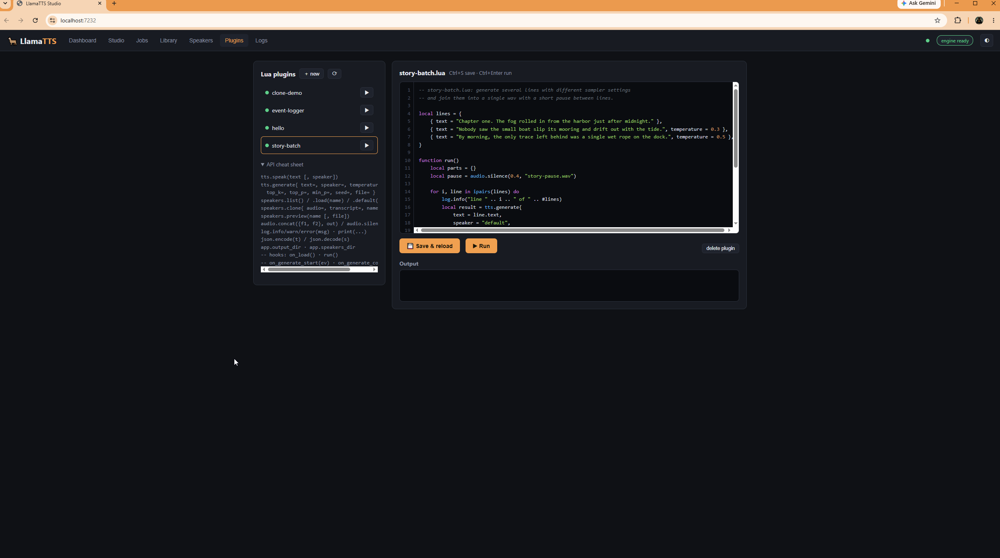
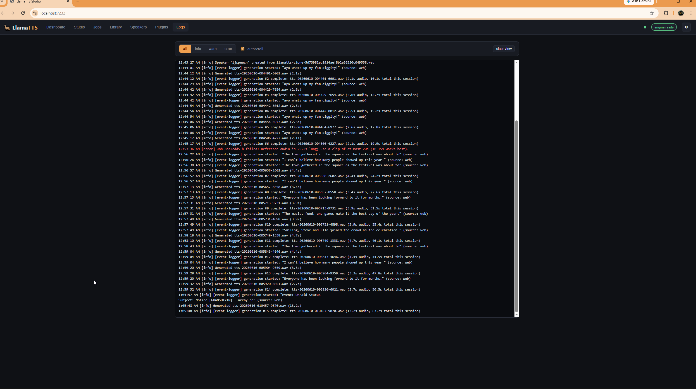

<div align="center">

# 🦙 LlamaTTS

### Local, scriptable text-to-speech for C# — llama.cpp running OuteTTS 1.0, a Lua plugin engine, and a live web studio

[](https://dotnet.microsoft.com/)
[](https://github.com/SciSharp/LLamaSharp)
[](https://huggingface.co/aoiandroid/Llama-OuteTTS-1.0-1B-GGUF)
[-000080?logo=lua&logoColor=white)](https://www.moonsharp.org/)
[](#-how-it-works)

*Type text → a 1B Llama fine-tune writes audio tokens → a neural codec turns them into a voice.*
*No cloud. No Python. No external processes. One `dotnet run`.*

**[🔊 Hear a real sample](samples/demo.wav)** — generated fully offline by the default voice

<br>



</div>

---

## ✨ What you get

| | |
|---|---|
| 🦙 **llama.cpp, embedded** | The GGUF model runs **in-process** via LLamaSharp — no server to babysit, no subprocess. Loads once, stays resident. |
| 🎙️ **Voice cloning** | Upload a **wav or mp3** — or **record straight from your mic** — plus a transcript, and get a reusable speaker profile. Profiles are OuteTTS-v3 compatible JSON. |
| 🌙 **Lua plugin engine** | Script generations, batch jobs, and voice cloning in sandboxed Lua. Plugins get event hooks for *every* generation in the app — edit them live in the browser with syntax highlighting. |
| 🎛️ **Web studio** | Waveform players, multi-take A/B generation with different seeds, a **dialogue mode** that casts a different voice per character and stitches the scene into one file. |
| 📡 **Live everything** | Server-sent events stream job progress, tokens/sec, and logs into the UI in real time. Job history survives restarts. |
| 📚 **Audio library** | Browse, search, multi-select, stitch, and delete everything you've generated — with lazy-decoded waveforms. |

## 🚀 Quick start

```powershell
git clone https://github.com/JohnBrandt00/llammatts.git
cd llammatts
dotnet run --project src\LlamaTts.Web
```

Open the printed URL, hit **⬇ download** on the dashboard (~1.1 GB: the GGUF + the DAC codec, straight from Hugging Face into `data/models`), then head to the **Studio** and press **▶ Generate**. The model loads on first use and stays warm.

> **GPU:** the CUDA 12 backend ships in the project — on an NVIDIA card the model is offloaded automatically (`GpuLayers` defaults to 99) and generation runs many times faster than realtime. No NVIDIA GPU? It silently falls back to CPU, where the 1B Q4_K_M still does ~40 tok/s ≈ **4× faster than realtime**. AMD users can swap in `LLamaSharp.Backend.Vulkan`.

## 🧠 How it works

[OuteTTS 1.0](https://huggingface.co/OuteAI/Llama-OuteTTS-1.0-1B) is a Llama-3.2-1B fine-tune that *speaks in codec tokens*: two interleaved codebook streams (`<|c1_N|>` `<|c2_N|>`) at 75 frames per second.



A fun wrinkle discovered along the way: llama.cpp's own `llama-tts` tool **cannot** run this model — the DAC decoder support was never merged upstream. So LlamaTTS pairs the LLM with the [official ONNX export](https://huggingface.co/OuteAI/DAC-speech-v1.0-ONNX) of IBM's DAC speech codec instead: the decoder turns tokens into audio, and the *encoder* powers voice cloning. Generation uses the sampler OuteTTS demands (temp 0.4, top-k 40, top-p 0.9, min-p 0.05, repetition penalty 1.1 **windowed to the last 64 tokens**), and the prompt/text pipeline is a faithful C# port of the official Python library.

## 🌙 Lua plugins

Drop a `.lua` file in `plugins/` — or click **＋ new** in the UI and write it there.

```lua
-- narrate.lua
function run()
    local voice = speakers.clone{
        audio = "my-voice.wav",                  -- 5–15 s reference clip
        transcript = "Exactly what I said in the clip.",
        name = "me",
    }

    local parts = {}
    for i, line in ipairs({
        "Chapter one. The fog rolled in from the harbor just after midnight.",
        "Nobody saw the small boat slip its mooring and drift out with the tide.",
    }) do
        local r = tts.generate{ text = line, speaker = voice, temperature = 0.35 }
        parts[i] = r.file
    end

    audio.concat(parts, "chapter-one.wav")
    log.info("done!")
end

-- optional hooks, fired for EVERY generation in the app:
function on_generate_complete(ev)
    log.info(ev.name .. " finished: " .. ev.seconds .. "s")
end
```

Full API: `tts.speak / tts.generate{}`, `speakers.list / load / clone{} / preview`, `audio.concat / silence`, `log`, `json`, `app.*` — sandboxed (no `io`, no `os.execute`), with file output confined to the output directory. Four example plugins ship in [`plugins/`](plugins/).

## 📸 Tour

| Dashboard — stats, speed, generation history | Jobs — live queue with progress & players |
|:--:|:--:|
|  |  |

| Library — search, stitch, waveforms | Speakers — clone from file or microphone |
|:--:|:--:|
|  |  |

| Plugins — in-browser Lua editor | Logs — live, filterable |
|:--:|:--:|
|  |  |

## ⚙️ Configuration

`src/LlamaTts.Web/appsettings.json` (or environment variables):

| Key | Default | What it does |
|---|---|---|
| `LlamaTts:Quant` | `Q4_K_M` | GGUF quantization to download/run (`Q2_K` … `Q8_0`, `FP16`) — on GPU, treat yourself to `Q8_0` or `FP16` |
| `LlamaTts:GpuLayers` | `99` | Layers to offload to GPU (CUDA 12 backend included; ignored on CPU) |
| `LlamaTts:ContextSize` | `8192` | llama.cpp context size |
| `LlamaTts:MaxCloneSeconds` | `20` | Reference-clip ceiling for cloning (hard-capped so the profile still fits the context) |
| `LlamaTts:ModelUrl` / `ModelFile` | – | Run any other v3-interface GGUF, e.g. the smaller [OuteTTS-1.0-0.6B](https://huggingface.co/OuteAI/OuteTTS-1.0-0.6B-GGUF) |
| `LlamaTts:RootDir` | auto | Where `data/` and `plugins/` live |

**Why is cloning capped at ~20 s?** The speaker profile isn't "training" — its audio codes are replayed into the model's context as a prefix on *every* generation, at ~165 tokens per second of reference. A 45 s clip would burn ~7,400 of the 8,192-token context and leave almost no room for the speech you asked for (and OuteTTS was trained on short references, so quality peaks around 10–15 s anyway). Use the cleanest 10–15 seconds you have; raise `MaxCloneSeconds` only if you like living dangerously.

## 🗂️ Layout

```
src/LlamaTts.Core    prompt builder · llama engine · DAC codec · cloning · Lua host · DSP
src/LlamaTts.Web     ASP.NET minimal API + SSE + the studio UI (vanilla JS, zero deps)
plugins/             Lua plugins (hello, story-batch, clone-demo, event-logger)
samples/             demo output
data/                models / output / speakers / history — created on first run
```

## 🙏 Credits

[OuteAI](https://huggingface.co/OuteAI) for OuteTTS 1.0 and the DAC ONNX export · [ggml-org/llama.cpp](https://github.com/ggml-org/llama.cpp) · [SciSharp/LLamaSharp](https://github.com/SciSharp/LLamaSharp) · [MoonSharp](https://www.moonsharp.org/) · [IBM Research](https://huggingface.co/ibm-research/DAC.speech.v1.0) for the DAC speech codec · GGUF quants mirrored by [aoiandroid](https://huggingface.co/aoiandroid/Llama-OuteTTS-1.0-1B-GGUF).

> Check the [model card](https://huggingface.co/OuteAI/Llama-OuteTTS-1.0-1B) for the model's own license terms before shipping audio commercially. Clone only voices you have the right to clone.


❯ make me a C# app that uses llamacpp (embed it?, build it on the side?)        
  https://huggingface.co/aoiandroid/Llama-OuteTTS-1.0-1B-GGUF                   
                                                                                
  to use llamatts in C#. add a lua plugin system so i can write lua scripts to  
  control and produce tts or clone a voice.                                     
                                                                                
  make a asp.net web ui to see how its working and what its done.  